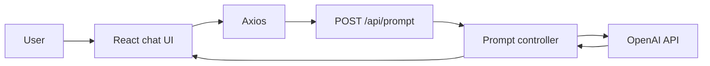

# ChatGPT API Interface

A small full-stack learning project that connects a React chat interface to a Node.js/Express backend and the OpenAI API.

The project was built to practice client-server communication, external API integration, basic React state management, and separation between frontend and backend responsibilities.

## What it does

Users can type a message in the React interface, send it to the backend, and receive an AI-generated response.

The frontend keeps the current conversation in local React state, while the backend is responsible for receiving the prompt, calling the OpenAI API, and returning the generated text.

## Main features

- Chat-style React interface
- Prompt submission from frontend to backend
- Axios-based HTTP communication
- Express API endpoint for prompt processing
- OpenAI API integration
- Basic prompt validation
- Local chat history stored in React state
- Simple separation between API, controller, configuration, and UI components

## Tech stack

### Frontend

- React
- JavaScript
- Axios
- CSS
- Create React App

### Backend

- Node.js
- Express
- JavaScript
- OpenAI SDK
- dotenv
- CORS

## Architecture



The API key stays on the server side. The browser sends only the user's prompt to the local backend, which performs the external API request and returns the generated response.

## Request flow

1. The user enters a prompt in the React interface.
2. The frontend sends a `POST` request to `/api/prompt`.
3. The Express route forwards the request to the prompt controller.
4. The controller validates the prompt.
5. The backend calls the OpenAI API.
6. The generated text is returned to the frontend.
7. The React interface adds both messages to the local chat history.

## Project structure

```text
.
├── server/
│   └── src/
│       ├── config/
│       │   └── openai.js
│       ├── controllers/
│       │   └── prompt-controller.js
│       ├── models/
│       ├── routes/
│       │   └── routes.js
│       ├── app.js
│       └── server.js
├── web/
│   └── src/
│       ├── api/
│       ├── components/
│       ├── styles/
│       └── App.js
├── package.json
└── README.md
```

## Technical decisions

### Keep the API key on the backend

The OpenAI credential is read from an environment variable on the server and is not exposed to the React application.

### Separate API communication from the UI

The frontend keeps the HTTP request logic in a dedicated API module instead of calling Axios directly from every UI component.

### Use a small controller-based backend structure

The Express route delegates prompt handling to a controller, while the OpenAI configuration is kept in a separate module. For a project of this size, this provides useful separation without adding unnecessary architecture.

## API

### Generate a response

```http
POST /api/prompt
```

Example request:

```json
{
  "prompt": "Explain REST APIs in simple terms."
}
```

Example response:

```json
{
  "success": true,
  "data": "..."
}
```

Requests without a prompt return a validation error.

## Running locally

### Requirements

- Node.js
- npm
- OpenAI API key

Clone the repository:

```bash
git clone https://github.com/comscijb/Chat-GPT-API.git
cd Chat-GPT-API
```

Create a `.env` file in the repository root:

```env
OPENAI_API_KEY=your_openai_api_key
PORT=5555
```

Install the backend dependencies from the repository root:

```bash
npm install
```

Install the frontend dependencies:

```bash
cd web
npm install
```

### Start the backend

From the `server` directory:

```bash
npm start
```

The API is expected to run locally on port `5555`.

### Start the frontend

In another terminal:

```bash
cd web
npm start
```

The React development server will start locally and communicate with:

```text
http://localhost:5555/api/prompt
```

## Build and testing

Build the frontend:

```bash
cd web
npm run build
```

The repository does not currently include a project-specific automated test suite.

Create React App includes its default test tooling, but automated application behavior is not documented here as implemented coverage.

## Current limitations

This is an early learning project, so the scope is intentionally small.

Current limitations include:

- no persistent conversation history
- no authentication
- no message streaming
- no configurable backend URL
- no production deployment configuration
- basic error handling
- chat state exists only in the browser session

These limitations are useful context for the project and also show the difference between this earlier implementation and my more recent full-stack work.

## Status

**Completed educational project.**

The core client-server OpenAI integration is implemented. The repository is kept public as part of my development history, but my current portfolio work uses a more complete TypeScript-based stack and more advanced application architecture.

## Author

**Jean Borges**

Full Stack Developer focused on TypeScript, React, Node.js, and modern web applications.

- Portfolio: [jeanborgesdev.com](https://jeanborgesdev.com)
- GitHub: [github.com/comscijb](https://github.com/comscijb)
- LinkedIn: [Jean Guilherme Borges](https://www.linkedin.com/in/jean-guilherme-borges-b91823272)
